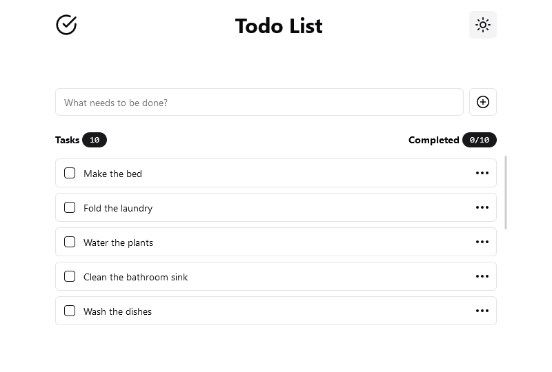
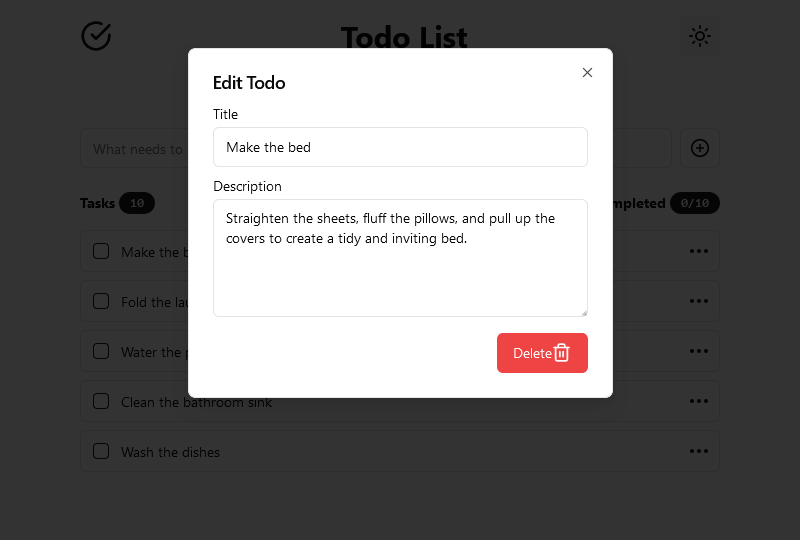
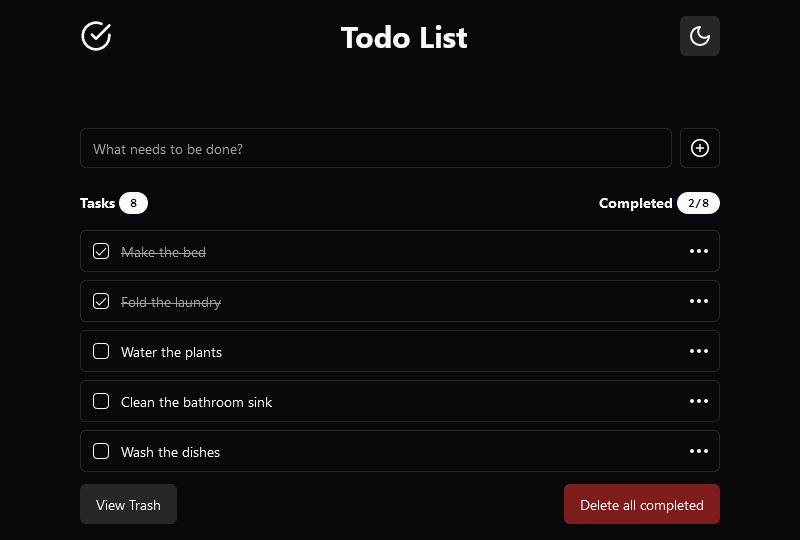
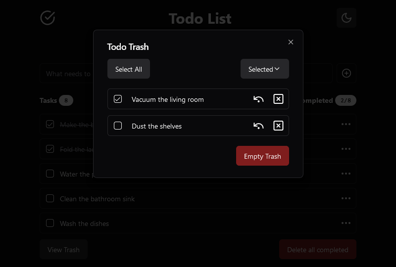

<div align="center">
  
  <h1>Todo List</h1>
  <p>
    Master Your Tasks: Simplify Your Productivity with Seamless ToDo Management!
  </p>
  <h4>
    <a href="https://github.ashthe.dev/todo/">View Demo</a>
    &emsp;&emsp;
    <a href="https://github.com/AshtonHeald/todo/issues/new">Report Bug</a>
  </h4>
</div>

## Table of Contents
- [About](#about)
  - [Screenshots](#screenshots)
  - [Description](#description)
  - [Features](#features)
  - [Tech Stack](#tech-stack)
- [Getting Started](#getting-started)
  - [Prerequisites](#prerequisites)
  - [Installation](#installation)
  - [Development](#development)
  - [Deployment](#deployment)
- [License](#license)

<!-- About -->
##  About
### Screenshots
  
|||
|:---:|:---:|
|||

### Description
  <p>Lorem Ipsum</p>

> [!NOTE]
>This app uses local storage, data will not carry over to/from other devices.

### Features

<dl>
  <dt>CRUD Functionality</dt>
  <dd>Lorem Ipsum</dd>
  <dt>Drag and Drop Sorting</dt>
  <dd>Lorem Ipsum</dd>
  <dt>Modals</dt>
  <dd>Lorem Ipsum</dd>
  <dt>Local Storage</dt>
  <dd>Lorem Ipsum</dd>
</dl>

### Tech Stack

<div>


</div>

<b>Other:</b>DnD-Kit, Lucide, Fontsource

<!-- Getting Started -->
##  Getting Started
### Prerequisites
This project uses pnpm as package manager
```bash
 npm install --global pnpm
```

### Installation

Clone the repository
```bash
git clone https://github.com/AshtonHeald/todo.git
```

Install dependencies
```
pnpm install
```

### Development

Start Vite dev server in the current directory.
```bash
pnpm run dev
```

Locally preview the production build. Do not use this as a production server as it's not designed for it.
```bash
pnpm run preview
```

### Deployment

Build for production. [Static Deploy](https://vitejs.dev/guide/static-deploy.html)
```bash
pnpm run build
```

---

<!-- Licence -->
### License

Distributed under the MIT License. See `LICENSE.md` for more information.
